### Android探路(1)：Windows平台开发环境搭建

#### 1. 前提准备工作
在安装Android Studio之前，先下载安装 JDK（Java Development Kit）。

下载地址：http://www.oracle.com/technetwork/java/javase/downloads/jdk8-downloads-2133151.html

关于JDK的安装这里就不作过多说明，但一定要记住安装完成后配置好JAVA_HOME 环境变量。如下图所示：

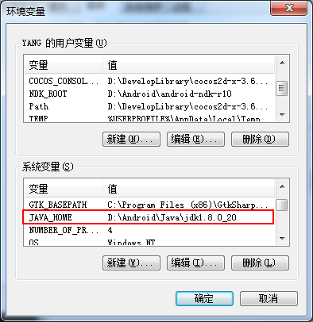

环境变量配置未配置或配置不正确，都会对后面的Android Studio的安装造成影响。在有些 Windows 系统中，Android Studio启动器脚本会提示无法找到 JDK 的安装位置。遇到此类问题时，就需要设置指示正确位置的环境变量。

---

#### 2. 下载Android Studio
下载地址：https://developer.android.com/studio/index.html

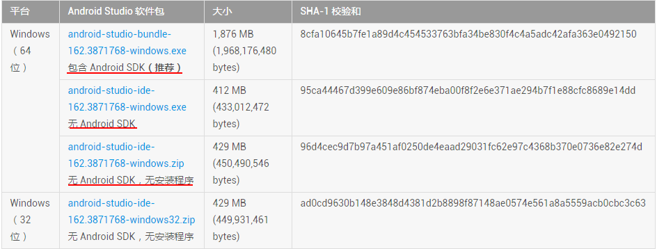

如上图所示，Android Studio的安装包划分了几种（是否包含Android SDK，是否有安装程序）。根据个人开发环境配置需要，选择所需的版本下载使用。

>- 如果是以前用Eclipse之类的环境进行过Android开发，那想必电脑上已经存在Android SDK了，这样即可选择无Android SDK的安装包；
>
>- 如果是纯净的电脑环境，未安装过任何开发工具，那建议选择包含Adnroid SDK的安装包。

---

#### 3. 安装Android Studio
安装过程也基本都是下一步→下一步的操作，中间步骤根据自己的需要进行选择即可。
##### 3.1 双击安装包文件进行安装
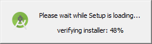

##### 3.2. SDK、模拟器安装选择
在第2部分安装包下载就已经提到过是否包含SDK的问题。本地是否已经存在SDK，对于安装操作的选择也会有所不同。

①如果本地没有SDK，则在安装时可以勾选SDK，下一步后选择SDK安装路径安装即可。如下图所示：
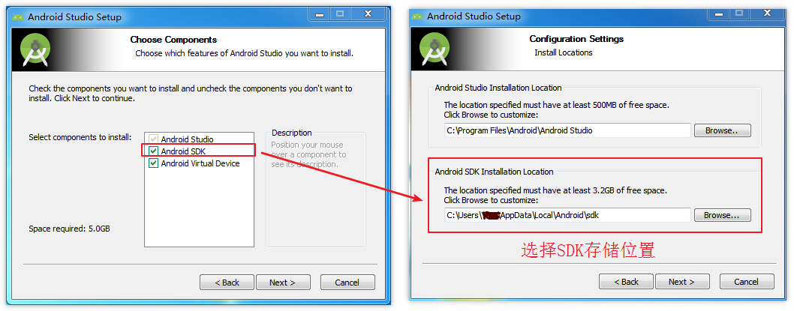

②如果本地已经有SDK，则可以选择不够选SDK，执行下一步后，会提示选择已经存在的SDK，根据提示选择后继续执行安装即可。如下图所示：
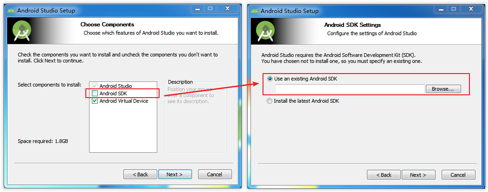

##### 3.3 Install安装
在前面的步骤中根据需要选择基本配置后，点击Next便进入最后的解压安装。
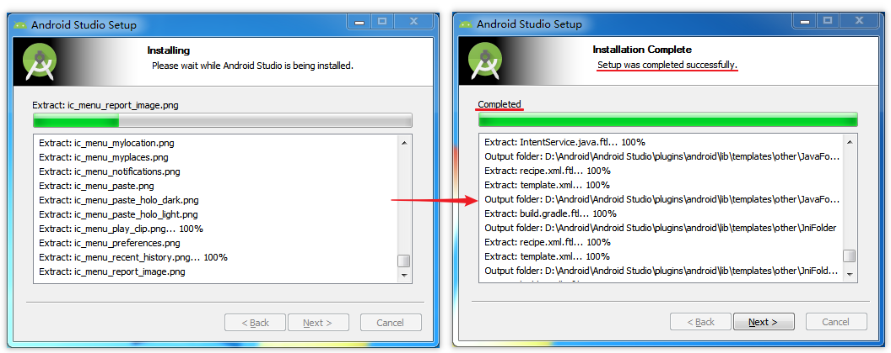

##### 3.4 安装完成
至此，即完成了Android Studio的安装。
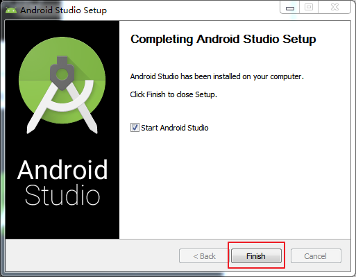

---

#### 4.启动Android Studio

安装完成后，第一次启动会有设置向导，用户根据实际需要进行一些基本的配置。

##### 4.1配置选择
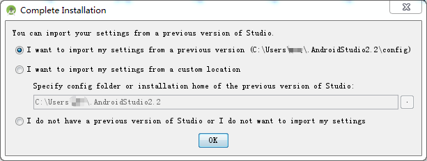

 每一次安装，都会显示这个界面。用以选择导入Android Studio的配置文件。

- 选项一 ：使用以前版本的配置文件夹。
- 选项二 ：导入某一个目录下的配置文件夹。
- 选项三 ：不导入配置文件夹。

如果你以前使用过Android Studio，可以选择到以前的版本。如果你是第一次使用，可以选择第三项。

##### 4.2 Unable to access Android SDK add-on lis
配置选择之后进入一个启动界面，但有时候可能会遇到如图所示的情况，提示"Unable to access Android SDK add-on lis"。
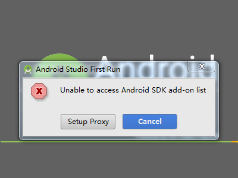

遇到这种情况时，有两种解放方案：

> - 方法一：在Android Studio安装目录下，找到\bin\idea.properties。修改disable.android.first.run=true
>
> - 方法二：点击Cancel，在后续的界面再安装SDK。（后面会有图示具体说明）

##### 4.3 Setup Wizard欢迎界面
虽然页面上显示的是Setup，其实是各种用户配置，诸如UI、SDK等等。如图所示，"欢迎页”告诉我们可以开发平板、手机、手表、TV、车载和眼睛的相关应用。
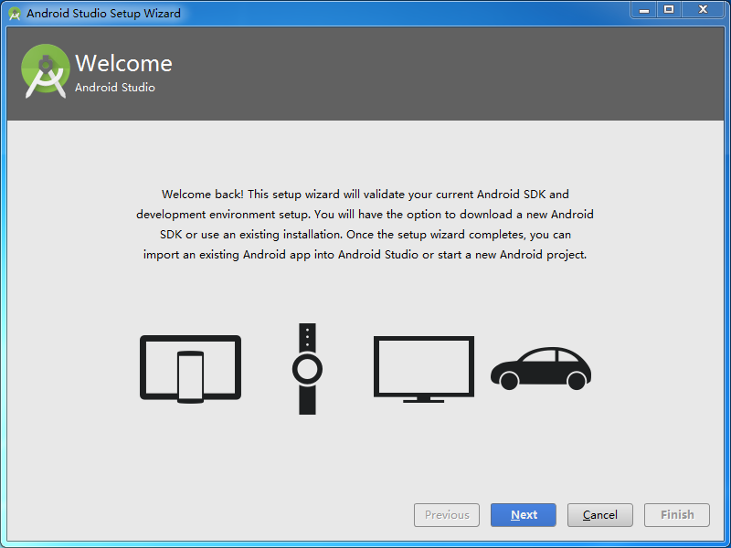

##### 4.4 设置Android SDK的位置
这里就是步骤4.2中提到的解决方案二，我们可以在这一步进行SDK的相关配置。

因为我们下载的安装包是包含SDK的，在前面的安装步骤中其实也已经解压安装了，这里选择对应的安装路径即可（默认会自动匹配路径）。
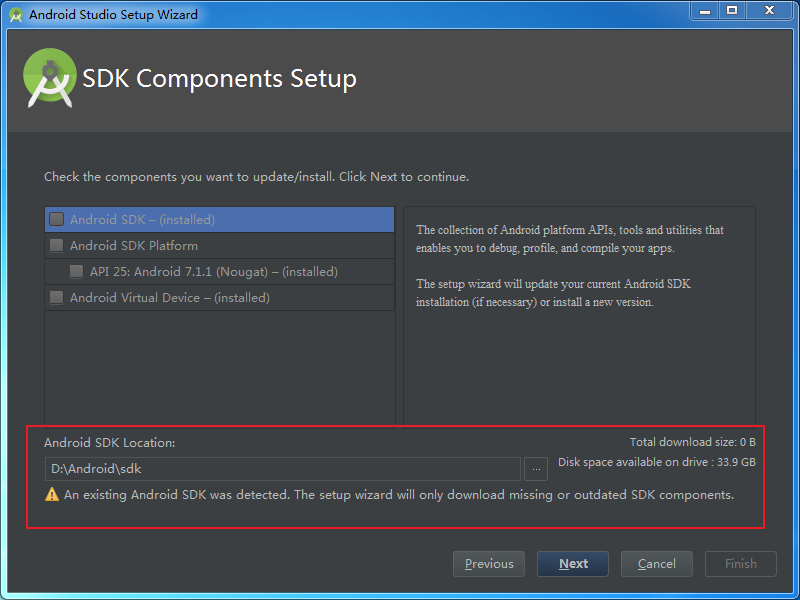

##### 4.5 欢迎使用Adnroid Studio
最后，所以配置完成，即可显示"Welcome to Android Studio"的界面，用户便可以在该界面执行创建工程等一系列操作。
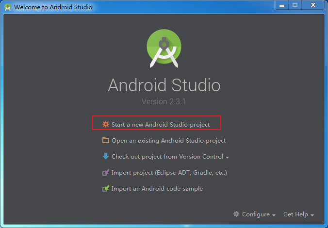

---

#### 5.总结说明
1.个人笔记中Android开发相关的技术文章所使用的开发工具为Android Studio.

2.关于开发环境的搭建，本文只是对于主要的部分做了说明，对于一些其他操作（诸如UI配置、工程导入等等）个人觉得放到后续学习过程中具体使用时再去进一步熟悉可能会更好，所以这里暂不作相关详解说明。
