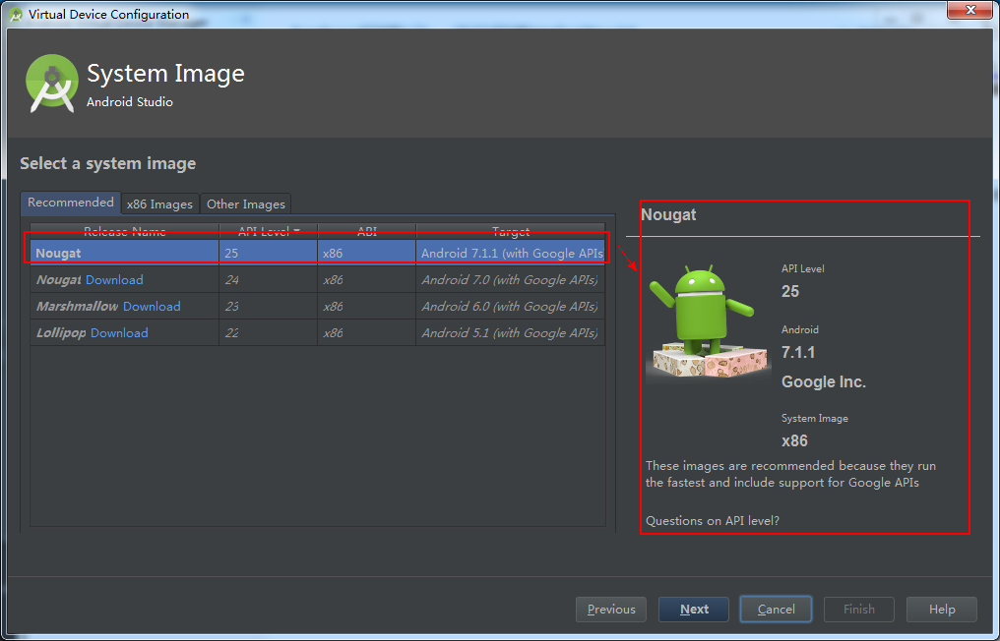

### Android探路(2)：项目创建

#### 一、项目创建步骤

##### 1. 开始创建工程
点击Start a new Android Studio Project创建一个新的工程

> 注：
> Android Studio中的Project，并不是真正的project，它其实跟eclipse中的workspace、visual studio中的solution是一个概念。

**Project** 的真实含义是工作空间， **Module** 为一个具体的项目。在Android Studio中，我们可以同时对多个Android Studio的 **Module** 进行同时编辑，这些 **Module** 在同一个 **Project** 之中。

| -- | Eclipse | IEDA/Android |
| - | :-: | -: |
| 工作区 | workspace| project |
| 项目 | project | moudle |
| 引用 | preference | module dependency |

##### 2. 工程名称、路程设置
之后便弹出如下所示界面：

> - **Application name** ：应用程序的名称。它是app在设备上显示的应用程序名称，也是在Android Studio Project 的名称。
> - **Company Domain** ：公司域名。影响下面的 Package name 。默认为电脑主机名称，当然你也可以单独设置 Package name 。
> - **Package name** ：应用程序包名。每一个app都有一个独立的包名，如果两个app的包名相同，Android会认为他们是同一个app。因此，需要尽量保证，不同的app拥有不同的包名。
> - **Project localtion** ： Project 存放的本地目录。 在该界面中我们可以设置创建应用名称、公司域名、包名以及工程的存储路径。这里我们以创建HelloWorld为例。然后点击Next进入下一步

##### 3. 项目类型选择
在这一步，我们可以选择创建的项目类型，同时选择API的最小版本。

> - **Phone and Tablet** ：表示 Module 是一个手机和平板项目。
> - **TV** ：表示 Module 是一个Android TV项目。
> - **Wear** ：表示 Module 是一个可穿戴设备（例如手表）项目。
> - **Glass** ：表示 Module 是一个 Google Glass 项目

点击Next进入下一界面：

##### 4. Activity模版样式选择
这里提供了多种Activity样式供用户选择，用户可以选择是否创建 Activity以及创建 Activity 的类型（这里我们选择**Empty Activity**）。

**注：**
> 如果你选择自动创建 Activity，Android Studio会自动帮你生成一些代码。根据 Activity
> 类型的不同，生成的代码也是不同的。

上图中选择模版样式后，点击Next继续进入到如下图所示界面，用户可以填写Activity的类名以及Activity的布局文件名称。

> - Activity Name ：自动创建的 Activity 的类名。
> - Layout Name ：自动创建的 Activity 的布局文件名称。

到这个界面我们已经看到了Finish按钮 ，这样就表示到了最后一步了。点击Finish按钮，你将会看到如下图所示的进度条。这个表示，Android Studio正在创建和编译你的项目。 软件会自动下载和gradle相关的组件，耗时较久（因为是第一次加载）。

##### 5.工程主窗口
点击Finish按钮，等待片刻之后，我们就可以看到我们所创建的工程的主窗口。如下图所示：

Android Studio 主窗口由如上图所示标注的几个逻辑区域组成：

> - **菜单栏**：提供基本的菜单类操作（文件、编辑、视图…）。
> - **工具栏**：提供执行各种操作的工具，包括运行应用和启动 Android 工具。
> - **导航栏**：帮助用户在项目中导航，以及打开文件进行编辑。 此区域提供 Project 窗口所示结构的精简视图。
> - **编辑器窗口**：创建和修改代码的区域。 编辑器可能因当前文件类型的不同而有所差异。 例如，在查看布局文件时，编辑器显示布局编辑器。
> - **工具窗口**：提供对特定任务的访问，例如项目管理、搜索和版本控制等。 您可以展开和折叠这些窗口。
> - **状态栏**：显示项目和 IDE 本身的状态以及任何警告或消息。

---

#### 二、运行应用
完成项目创建后，接下来我们就要试着运行一下我们的程序。运行程序有两种方式：

##### 1.实体设备上运行应用
1.1）实体设备设置

> ①使用USB 线将设备连接到开发机器。
>
> ②手机开启调试模式。转到 Settings > Developer options，在您的设备上启用USB debugging。

1.2） Android Studio中启动应用

> ①在 Android Studio 中，选择要运行的项目，然后点击工具栏中的 Run 。
>
> ②在 Select Deployment Target 窗口中，选择实体设备，然后点击OK。

Android Studio 便会在连接的设备上安装并启动应用。

##### 2.模拟器上运行应用
1.1）创建AVD

在模拟器上运行您的应用之前，需要创建一个**Android Virtual Device(AVD)** 定义。
①选择菜单栏Tools > Android > AVD Manager或者点击工具栏上的[AVD Manager]图标，启动 Android Virtual Device Manager。

②在 Your Virtual Devices 屏幕中，点击 Create Virtual Device。

③在 Select Hardware 屏幕中，选择电话设备（如 Nexus 6），然后点击 Next。

④在 System Image 屏幕中，选择 AVD 所需的系统版本，然后点击 Next。

如果未安装特定版本的系统，则可通过点击 Download 链接获取它。

⑤验证配置设置（对于您的第一个 AVD，请将所有设置保持原样），然后点击 Finish。

 2.2）Android Studio中启动应用

> ①在 Android Studio 中，选择您的项目，然后点击工具栏中的 Run  。
>
>  ②在 Select Deployment Target 窗口中，选择您的模拟器，然后点击 OK。

运行效果如下图所示：

至此， Android 应用的创建过程及运行方法也就全部完成，就是这么简单！当然，当中可能还有一些细节部分没有详细说明，后续的开发学习中会再进一步说明，敬请关注！
