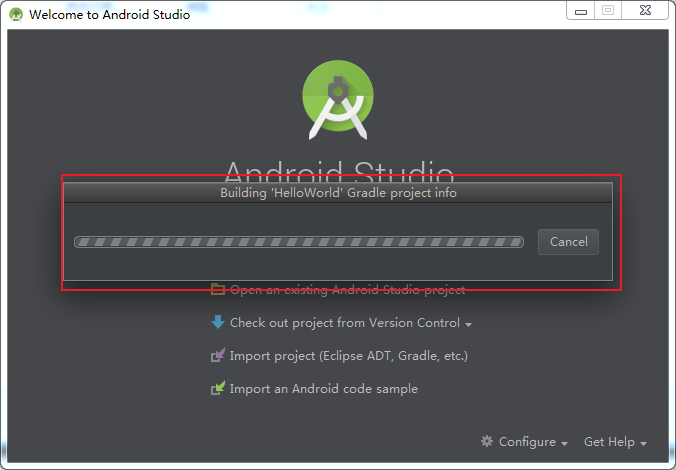
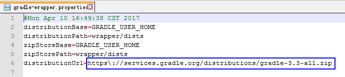
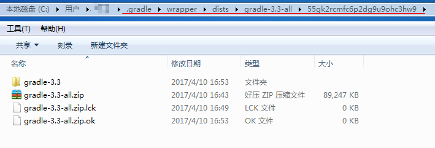
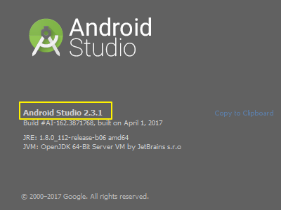

### Android探路(3)：解决Building gradle project info卡住的问题

在上一篇《Android探路(2)：项目创建HelloWorld》中我们学习了如何创建工程，但如果真正按照说明去操作后就会发现一个问题。在最后点击Finish按钮后，会出现如下界面：

起初，笔者以为这个停留片刻后便会进入主界面，然而实际情况是界面会一直卡在这地方，why？？？

实际上，这是由于Android studio 会根据指定的url去Gradle官网下载新版文件，所需时间过长，很大可能下载不成功，一直卡在Building gradle project info界面（注：包括导入工程时一些操作出现Building gradle project info或者refreshing gradle project等情况，实际上也都是同样的问题造成的）。

那么问题来了，为什么会去下载Gradle？有没有什么解决方案呢？

---

#### 一、为什么需要下载Gradle？
根据提示我们知道项目实际是已经创建了，我们找到项目的目录，根据项目中 \gradle\wrapper\gradle-wrapper.properties文件的配置，发现最后一行代码指明了去下载指定版本的gradle。如下图所示：

我们发现请求的版本是gradle-3.3.

默认下载的gradle保存在**C:\Users\用户名\.gradle\wrapper\dists\gradle-x.xx-all\xxxxxxxxxxxx**。如下图所示：

界面一直卡住，实际上就是这地方文件一直未下载完成。gradle官网虽然可以访问，但是速度真的是龟速啊…

---

#### 二、Android gradle plugin和 Gradle版本版本说明
在上一步问题查找中我们发现配置要求下载的Gradle版本是3.3，那么其他版本是否可以呢？

实际上，Android gradle plugin和 Gradle版本关系需要正确匹配，如果不正确，可能出现报错或重新去下载最新版本的Gradle。

Android gradle plugin和 Gradle版本关系如下：

Android Gradle Plugin Version | Required Gradle Version
- | :-: | -:
1.0.0 – 1.1.3 | 2.2.1 – 2.3
1.2.0 – 1.3.1 | 2.2.1 – 2.9
1.5.0 | 2.2.1+
2.0.0 – 2.1.2 | 2.10 – 2.13
2.1.3+ | 2.14.1+
2.3.0+ | 3.3+

参考地址：[https://developer.android.com/studio/releases/gradle-plugin.html](https://developer.android.com/studio/releases/gradle-plugin.html)

我们检查本地安装的Android Studio版本信息：

Android Studio的版本为2.3.1，对应的Gradle版本应该为3.3+。（注：笔者下载的Android Studio2.3.1版本，安装目录中自带的Gradle版本为3.2，根据表格上的对应关系来说版本是不匹配的，所以笔者下载离线包做了更新）

----------

#### 三、解决方案
至此，了解了问题原因，接下来我们就要考虑如何解决问题。这里提供两种解决方案：

##### 1. 下载Gradle离线压缩包
在前面的讲解中，我们已经知道了Gradle的版本匹配关系，也已经知道了默认下载的存储位置。既然这样，我们便可以到官网去下载对应版本的压缩包。

下载地址：https://gradle.org/releases

下载完成后，复制到C:\Users\用户名\.gradle\wrapper\dists\gradle-x.xx-all\xxxxxxxxxxxx目录下，运行Android Studio之后会自动解压。重新打开项目即可。

##### 2. 使用Android Studio自带的Gradle
File→Setting，在设置对话框中中打开Gradle，如下所示：

> - **use default gradle wrapper**（官方推荐）  根据项目中\gradle\wrapper\gradle-wrapper.properties文件配置，下载指定版本的gradle(默认存储路径：C:\Users\用户名\.gradle\wrapper\dists\gradle-x.xx-all\xxxxxxxxxxxx)。
> - **Use local gradle distribution**  
> 选择Use local gradle distribution，然后选择Gradle
> 的目录即可。这样就不用每次根据项目中\gradle\wrapper\gradle-wrapper.properties文件中的配置去下载指定版本的gradle。而是直接使用本地指定的gradle。

这里我们选择Use local gradle distribution，并指定Gradle路径即可（注：不管那种方式，注意版本匹配）。

问题圆满解决！ ^_^
