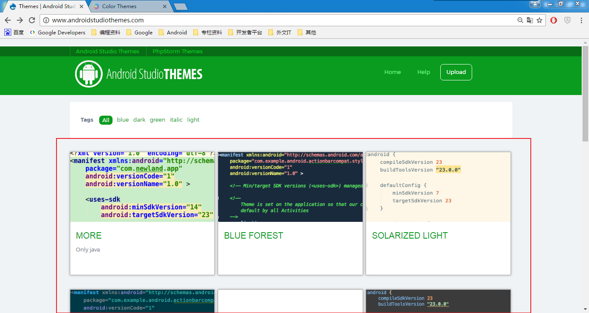

### Android探路(4)：Android Studio配置

在前几篇Android探路笔记中，我们已经完成了开发环境的搭建，并且创建了HelloWorld工程。接下来，我们进一步熟悉一下我们的开发工具，了解一下相关配置，帮助我们可以更高效的进行开发。

关于Android Studio的配置，我们这里将其划分为两类：

- ① 显示类配置。主要是界面显示效果相关的一些设置（主题、颜色等等）;

- ② 功能类设置。主要是涉及IDE功能使用，开发中涉及功能相关的配置等等。

---

#### 一、显示类配置

##### 1. IDE主题设置
Android Studio默认的主题是灰白色，估计很多人都会觉得不怎么好看。和其他IDE一样，Android Studio也支持主题设置。

**设置方法**：

*File -> Settings -> Appearance & Behaviour -> Appearance -> Theme*， 在Theme下来列表中选择主题即可。

除了系统默认提供的可选择的主题外，我们可以导入一些第三方主题以及代码配色方案。

主题下载地址：

Android Studio Themes： [http://www.androidstudiothemes.com/](http://www.androidstudiothemes.com/)
Color Themes：[http://color-themes.com](http://color-themes.com)

主题样例如下：

下载下来之后，是一个jar包。然后在Android Studio中选择菜单栏“ File-Import Settings”，将下载好的jar包导入即可。

##### 2. 代码样式配置

**修改方法**：

**File -> Settings -> Editor -> Colors & Fonts -> Font**, 在Editor Font对应选项操作中设置即可。

##### 3. Logcat颜色设置

Android Studio的logcat默认的只有Error和Assert是红色的而且没有差别，用户可以根据需要配置不同Log的显示方案。

修改方法：

File -> Settings -> Editor -> Colors & Fonts -> Android Logcat ，点中Assert、Debug、Error等选项，然后在后面将Use Inberited attributes 去掉勾选 ，再将 Foreground 前的复选框选上，就可以双击后面的框框去选择颜色。

---

#### 二、功能类设置

##### 1. 快捷键设置
如果在使用Android Studio之前习惯了其他IDE的快捷键操作，Android Studio提供了相关选项配置(如下图)方便用户保留以前的快捷键使用习惯。

**修改方法**：

**File -> Settings -> Keymap**, 在Keymap下拉选项中提供了其他IDE选项供用户选择。除此之外，用户还可以在Editor Actions列表中编辑设置某个操作的快捷键。

##### 2. 禁止IDE启动时打开上次的项目
Android Studio默认情况下时将此项开启的，笔者一开始在使用Android Studio时就还奇怪怎么会每次都默认打开上一次的工程。之后发现这个是可以修改设置的。

**修改方法**：

*File -> Settings ->  Appearance & Behaviour -> System Settings*, 去掉”Reopen last project on startup”的勾选即可

##### 3. 代码自动提示

**设置方法：**

*File -> Settings ->  Editor -> General -> Code Completion*, 勾选”Autopopup code completion“即可。（如图所示）

注：

> ①代码提示的快捷键可在KeyMap中可以设置；
>
> ②AndroidStudio默认的代码提示是大小写敏感的，可以配置代码提示的大小写 区分。在“Case sensitivecompletion”中选择None即可不区分大小写

##### 4. API文档悬浮提示
Android Studio默认是没有api文档悬浮提示的，只有按住【Ctrl+Q】太会出现提示。

如果要添加api的自动悬浮提示，设置方法如下：

*File -> Settings ->  Editor -> General*, 勾选”Show quick documentation on mouse move“即可

#####5. 文件头设置
编码中，我们一般都会在文件头部写上相关必要注释（作者，版本等等）。为了避免每新建一个文件就要去写一次的麻烦，我们可以进行文件头设置。

**设置方法：**

*File -> Settings ->  Editor -> File and Code Templates*, 选择File Header后编辑内容即可（如下图所示）。

##### 6. 文件编码
默认的文件编码方式是utf-8，用户可根据需要进行修改IDE或Project的编码格式。

**设置方法**：

*File -> Settings ->  Editor -> File Encodings*, 在IDE Encoding和Project Encoding对应的下来列表中选择编码格式即可。

##### 7. 自动导包设置
在Eclipse中，我们只有每次引用一些类的时候必须要导包，而Android Studio中则可以设置成自动导包。

**设置方法**：

*File -> Editor -> General -> Auto Import*，勾选”Optimize imports on the fly“和”Add unambiguous imports on the fly“即可

##### 8. SDK、JDK、NDK设置

**设置方法**：

*File -> Project Struct -> SDK Location*, 设置对应的本地的文件路径即可。

##### 9. 导出／导入我的设置
在Android Studio中如果我们做了很多符合个人习惯的设置，如果某天电脑重装系统或者重新安装了Android Studio，那之前的这些设置咋办？难得要重新设置一遍？这无意非常的浪费时间，Android Studio提供了一个可以导出设置操作，而电脑重装或Android Studio重新安装后，我们只需要再直接导入即可。

**操作方法**：

*File -> Import Settings*(或*Export Settings*)

----------
